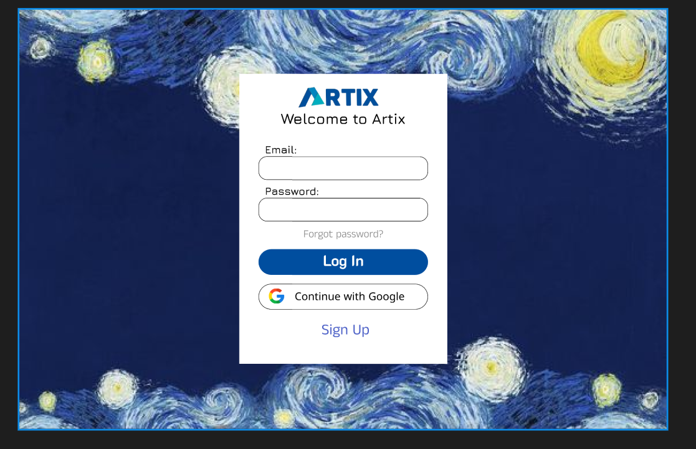
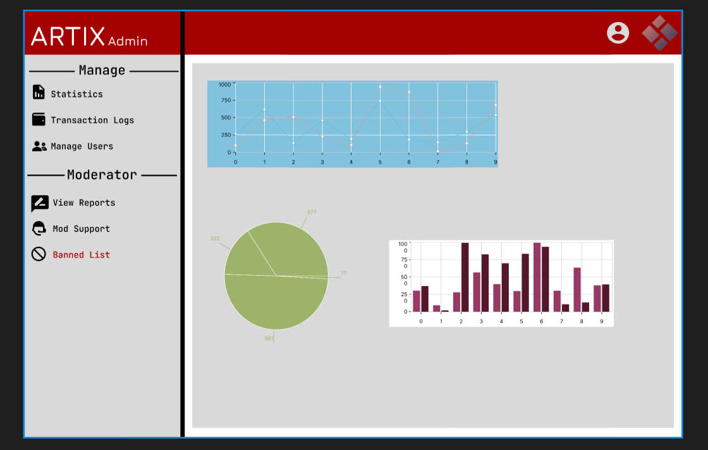

- # Artix - Artwork Sharing Platform
  - ### Logo
    
- # **Project Synopsis :**
  - **Class:** SWP391-SE1705-SP2024
  - **Project Supervisor:** Nguyen The Hoang - HoangNT20
  - **Topic:** Topic 10 (Artix)
  - **Authors:**
    - Nguyễn Dương Gia Bảo - SE171697 - Rous1141 - FE | BE | PM
    - Huỳnh Thiện Nhân - SE171117 - Dacoband - BE | Database Desgin
    - Trần Ánh Tuyết - SE170234 - GUI Design | FE
    - Nguyễn Minh Thức - SE170592 - Database Design | BE
    - Phạm Minh Triều - SE172937 - Documentation
  - **Project:** Arkworks Sharing and Selling Platform - Social Media, E-Commerce hybrid - Consumer to Consumer
  - **Techs:** RestfulAPI - mySQL - ReactJS - MaterializeCSS - Bootstrap - JavaScript - Paypal - MUI - .NET 8 with C# - Vercel - Azure - Avien 
  - **Structure:** Using MVC1 Structure 
- # **Table Of Contents**
  - ### [Specifications](#specifications)
    - [Process 1](#process-1-register-an-account)
    - [Process 2](#process-2-check-login-information)
    - [Process 3](#process-3-product-management)
    - [Process 4](#process-4-get-product-details)
    - [Process 5](#process-5-cart-management)
    - [Process 6](#process-6-payment-management)
  - ### Technologies
  - ### Use Case Diagram
  - ### Design Figma - Draw GUIs
    - ### **Login & Sign Up :**
      - Login Page :
        
      - Sign Up Page :
        
    - ### **Admin Page :**
      - *Manage* :
        - Statistics :
          
        - Transaction Logs : 
          
        - Manage Users :
          
      - *Moderator* :
        - View Reports :
          
        - Mod Supports :
          
        - Banned Listed :
          
    - ### **Users Page :**
      - *Home Page* :
        
      <!-- Sẽ cập nhật sau -->
  - ### Future Advancement
  - ### Limitation

- # Specifications
   - ### Process 1 Register An Account :
      - Send form to Guest to register
      - Phone Number
      - Email
      - Password
      - Conform password
      - Automatically assign roleid to user
   - ## Process 2 Check Login Information :
      - Get user information
      - Check whether it is a guest or a user to grant permissions to the user
      - If you are a guest, you do not have the right to buy, sell or post works on the website
      - User or Admin has the right to create products, add, remove, delete... (Only admin has the right to edit User rights.)

## Process 3 Product Management
• 
    

## Process 4 Get Product Details

• The website sends detailed information about the work to customers in a new website

• Name

• Information

• The Review of the work

• Add wishlist

## Process 5 Cart Management

• Create a cart if the cart is empty

• Add to cart (detail to cart)

• Name

• Delete 1

• Update the cart when the user makes adjustments

• Delete the entire cart

• Go to payment

## Process 6 Payment Management

• The store allows customers to choose payment methods in many ways:

• Directly text the artist: Message the artist directly to make payment

• Indirect: Online payment via banking app or apps like MOMO, ZaloPay, etc.

• Apply discount code

• Cancel payment

• Check whether the payment is successful or not sent by the web side that accepts the payment (if successful, go back to the payment details page and show a successful payment popup to the customer/ if it fails, go back to the cart page and show payment failed)
